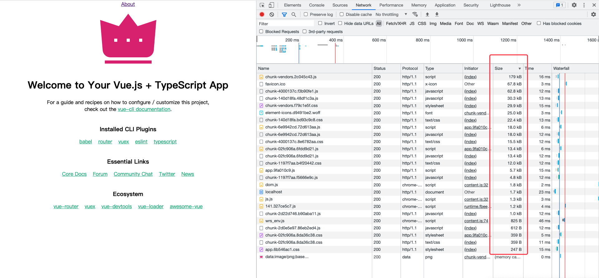
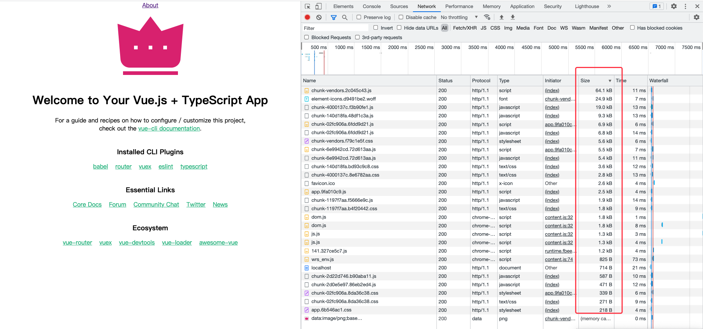

# WebServer

> 支持传统应用，支持单页应用。

## 一个简单易用的Web服务。

### 下载：[Releases](https://github.com/zhangzhichaolove/WebServer/releases)

### 为了更加方便，现已支持[docker-部署](./docker-new.md)了,镜像大小仅2M.

## 更新:

# 2022-10-09更新版本->1.0.5

> 提示：运行方式改变，方便将此程序配置到环境变量使用，当前目录存在`app.yaml`文件时，优先使用配置文件启动服务。

#### 1.增加-help命令，方便查看帮助文档。

```
$ webServer -h            
提示:更多指令通过 -help 获取
Usage of webServer:
  -clear
        清除缓存
  -d int
        是否后台运行，默认：0 [0/前台运行 1/后台运行 2/关闭后台运行]
  -help string
        帮助
  -i    是否生成配置文件
  -p int
        启动端口，默认：80  (default 80)
  -w string
        需要展示的web目录，默认：. [默认会使用当前路径下的index.html作为首页] (default ".")
```

#### 2.增加-clear命令，方便清除文件缓存。

```
$ webServer -clear
```

#### 3.增加-p命令，方便指定启动端口。

```
$ webServer -p 88 -w web
```

#### 4.增加-w命令，方便指定web目录。

```
$ webServer -w dist
$ webServer -w /data
$ webServer -w ./web
```

#### 5.增加-d命令，方便指定后台启动方式。

```
$ webServer -d 0
```

#### 6.增加-i命令，方便在当前目录生成配置文件，用于启动多个服务时，根据不同的配置启动。

```
$ webServer -i
```

---

# 2022-04-16更新版本->1.0.4
> 提示：可将本程序配置在环境变量，在任意工程目录运行，如果运行时指定web目录，会在程序所在目录生成配置文件（如果运行时未指定web目录，会使用配置中的web目录），也可将本程序直接放入工程目录，然后使用命令行运行，会在工程目录生成配置文件，未指定web目录时，会使用配置中的web目录。
#### 1.支持自动加载目录下的index.html
#### 2.支持自定义404页面配置
#### 3.支持自定义路径配置

```shell
# 运行时指定路径(相对路径)
./webServer -p=dist
# 运行时指定路径(相对路径)
./webServer -p=./dist
# 运行时指定路径(绝对路径)
./webServer -p=/data/dist
# 运行时指定运行方式以及路径
./webServer -d=0 -p=/data/dist
```

---

# 2022-04-11更新版本->1.0.3
#### 1.支持多架构镜像
```
linux/amd64
linux/arm64
linux/386
linux/ppc64le
```
#### 2.后台运行方式改变

```shell
# 默认前台运行
./webServer
# 后台方式运行
./webServer -d=1
# 关闭后台运行
./webServer -d=2
# 0/前台运行 1/后台运行 2/关闭后台运行
```

---

# 2022-01-18更新版本->1.0.2
#### 1.支持后台运行

```shell
# 默认后台运行
./webServer
# 关闭后台运行
./webServer stop
# 前台方式运行
./webServer -d=false
```

---

# 2021-12-15更新版本->1.0.1
#### 1.添加服务配置文件（首次启动会自动生成）
#### 2.支持配置自定义端口。
#### 3.支持https配置（需要配置证书）

---

> 特色：

#### 1.为单页应用提供服务时，不会出现history路由模式下刷新404问题。
#### 2.项目打包时，无需压缩源文件，服务运行后，会根据客户端访问动态使用gzip压缩并缓存至本地。

## 使用步骤：

#### 1.将对应平台的`webServer`文件拷贝至项目目录。

> 结构如下：

```
├── dist (前端build之后的目录)
└── webServer
```


#### 2.运行`webServer`

```
./webServer
```

#### 3.修改运行配置并重启-可选

> 首次运行后，会在当前目录生成默认`app.yaml`配置文件，结构如下：

```
├── dist (前端build之后的目录)
├── app.yaml (生成的默认配置文件)
└── webServer
```

> `app.yaml`配置如下：

```
server:
  path: ./dist
  https: false
  port: 80
  pem: ./ssl/ssl.pem
  key: ./ssl/ssl.key
```

> 修改`app.yaml`配置到https：

```
server:
  path: ./dist
  https: true
  port: 443
  pem: ./ssl/ssl.pem
  key: ./ssl/ssl.key
```

> 重启生效：

```
./webServer
```

## 使用对比：

> 运行前目录结构如下：

```
├── web
│   ├── css
│   │   ├── app.6b546ac1.css
│   │   ├── chunk-02fc906a.8da36c38.css
│   │   ├── chunk-1197f7aa.b4f20442.css
│   │   ├── chunk-140d18fa.bd93c9c8.css
│   │   ├── chunk-4000137c.8e6782aa.css
│   │   └── chunk-vendors.f79c1e5f.css
│   ├── favicon.ico
│   ├── fonts
│   │   ├── element-icons.abe71f7d.ttf
│   │   └── element-icons.d9491be2.woff
│   ├── index.html
│   └── js
│       ├── app.9fa010c9.js
│       ├── chunk-02fc906a.6fdd9d21.js
│       ├── chunk-1197f7aa.f5666e9c.js
│       ├── chunk-140d18fa.48df1c3a.js
│       ├── chunk-2d0e5e97.86eb2ed4.js
│       ├── chunk-2d22d746.b90aba11.js
│       ├── chunk-4000137c.f3b90fe1.js
│       ├── chunk-6e9942cd.72d613aa.js
│       └── chunk-vendors.2c045c43.js
└── webServer

```

> 运行后目录结构如下：

```
├── web
│   ├── css
│   │   ├── app.6b546ac1.css
│   │   ├── app.6b546ac1.css.gz
│   │   ├── chunk-02fc906a.8da36c38.css
│   │   ├── chunk-02fc906a.8da36c38.css.gz
│   │   ├── chunk-1197f7aa.b4f20442.css
│   │   ├── chunk-1197f7aa.b4f20442.css.gz
│   │   ├── chunk-140d18fa.bd93c9c8.css
│   │   ├── chunk-140d18fa.bd93c9c8.css.gz
│   │   ├── chunk-4000137c.8e6782aa.css
│   │   ├── chunk-4000137c.8e6782aa.css.gz
│   │   ├── chunk-vendors.f79c1e5f.css
│   │   └── chunk-vendors.f79c1e5f.css.gz
│   ├── favicon.ico
│   ├── favicon.ico.gz
│   ├── fonts
│   │   ├── element-icons.abe71f7d.ttf
│   │   ├── element-icons.d9491be2.woff
│   │   └── element-icons.d9491be2.woff.gz
│   ├── index.html
│   ├── index.html.gz
│   └── js
│       ├── app.9fa010c9.js
│       ├── app.9fa010c9.js.gz
│       ├── chunk-02fc906a.6fdd9d21.js
│       ├── chunk-02fc906a.6fdd9d21.js.gz
│       ├── chunk-1197f7aa.f5666e9c.js
│       ├── chunk-1197f7aa.f5666e9c.js.gz
│       ├── chunk-140d18fa.48df1c3a.js
│       ├── chunk-140d18fa.48df1c3a.js.gz
│       ├── chunk-2d0e5e97.86eb2ed4.js
│       ├── chunk-2d0e5e97.86eb2ed4.js.gz
│       ├── chunk-2d22d746.b90aba11.js
│       ├── chunk-2d22d746.b90aba11.js.gz
│       ├── chunk-4000137c.f3b90fe1.js
│       ├── chunk-4000137c.f3b90fe1.js.gz
│       ├── chunk-6e9942cd.72d613aa.js
│       ├── chunk-6e9942cd.72d613aa.js.gz
│       ├── chunk-vendors.2c045c43.js
│       └── chunk-vendors.2c045c43.js.gz
└── webServer

```

## 压缩前后对比

> 压缩前



> 压缩后



## 使用方式：

### 运行

```
./webServer
```

### 查看

[http://localhost](http://localhost)
[https://localhost](https://localhost)

